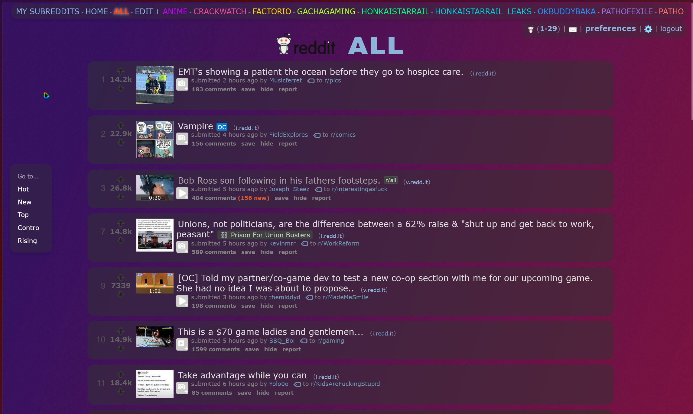
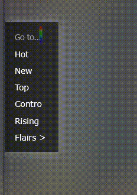

# FallenStar's Pretty Reddit

It do be making the old reddit pretty

## Overview

This repository hosts a collection of CSS and JavaScript files designed to improve the visual appearance and functionality of old.reddit.com.

### Features

-   Cool floating panel for sorting, also includes a "Go To" subreddit feature
-   It even checks if the subreddit exists!

    

-   The Navbar has been enhanced and you can now scroll it horizontally.

    

### Installation

Requires [Reddit Enhancement Suite](https://redditenhancementsuite.com/) with nightmode enabled

Install the css using Stylus

-   [Firefox](https://addons.mozilla.org/en-US/firefox/addon/styl-us/)
-   [Chrome](https://chromewebstore.google.com/detail/stylus/clngdbkpkpeebahjckkjfobafhncgmne)

Install the usercripts using your favorite userscripts manager (I recommend [ViolentMonkey](https://violentmonkey.github.io/))

### Contributing

Don't

### Credits

-   Snesh
-   Loky
