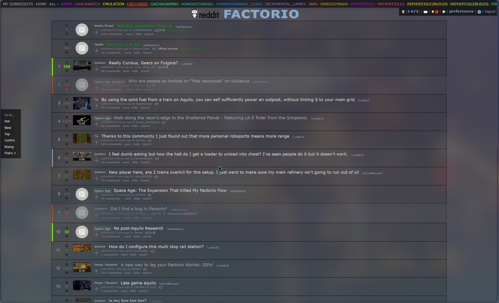

# FallenStar's Pretty Reddit

Making old Reddit pretty again! (not that it ever was)

## Overview

This repository hosts a collection of CSS and JavaScript files designed to improve the visual appearance and functionality of old.reddit.com.

### Features

-   **Cool floating panel** for sorting, includes a "Go To" subreddit feature

    -   It even checks if the subreddit exists!
    -   Draggable for added coolness

        

-   **Enhanced Navbar** with horizontal scrolling (using the mousewheel, not the ugly RES button)
    

-   **Hidden and pretty sidebar** (pretty means transparent)
    

    Configure colors and minor cosmetic changes through Stylus options:

    

### Installation

Prerequisites:

-   [Reddit Enhancement Suite](https://redditenhancementsuite.com/) with nightmode enabled
-   Stylus: [Firefox](https://addons.mozilla.org/en-US/firefox/addon/styl-us/) | [Chrome](https://chromewebstore.google.com/detail/stylus/clngdbkpkpeebahjckkjfobafhncgmne)
-   Userscript manager (recommended: [ViolentMonkey](https://violentmonkey.github.io/))

Easy install links:

| Component                 | Install                                                                                                                                                                                                                   |
| ------------------------- | ------------------------------------------------------------------------------------------------------------------------------------------------------------------------------------------------------------------------- |
| Main CSS file             |               |
| Floating Sorting Panel JS |           |
| SideBar JS                |  |
| NavBar JS                 |           |

To get the fancy bar for collapsing comments, enable this option in the Reddit Enhancement Suite dashboard:

### TODO

-   [x] Fix floating video thingy when scrolling in comments (needs more JS to improve, make it draggable)
-   [ ] Put most of the useless stuff in the sidebar 🚧
-   [ ] Display comments without changing page
-   [x] Fix more Chromium issues
-   [x] Re-add sort button to navbar (added to sidebar)
-   [x] Add sort panel for comment section
-   [x] Fix flairs
-   [x] Add option to show/hide vanilla sorting options if using the panel
-   [ ] On top page, make panel become links for past year/months etc.
-   [ ] Add font options (monaspace?)
-   [x] Fix ugly expando buttons on posts
-   [x] Add back sorting by comments/posts to user page

### Contributing

Don't 😉

### Credits

-   [Snesh](https://github.com/senshastic) ❤️
-   Loky 🐈
-   Zoey 🐈‍⬛
